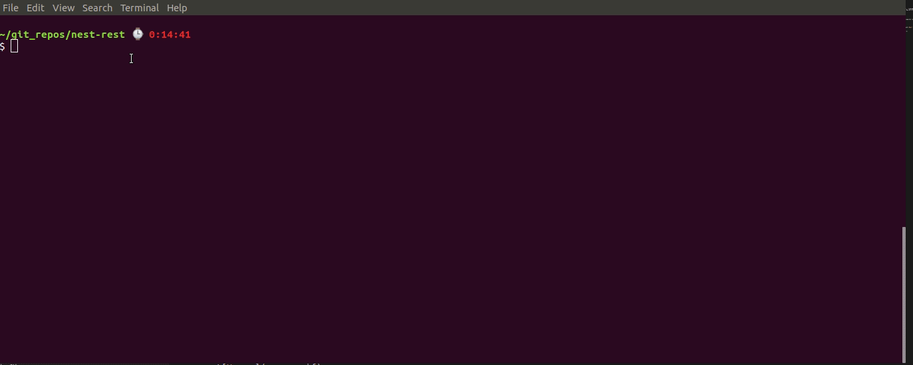

# Useful Schematics for Nest JS

## Description

In order to help people manage their projects, the CLI tool has been created. It helps on many grounds at once, from scaffolding the project to build well-structured applications. The Nest CLI is based on the [@angular-devkit](https://github.com/angular/devkit) package. Also, there're special schematics that are dedicated to the Nest development [@nestjs/schematics](https://github.com/nestjs/schematics).


## Installation
### NPM:

```
$ npm install -g @kalacs/schematics
```

## Usage
```
schematics @kalacs/schematics:rest_module --no-dry-run --spec --language="ts" --sourceRoot="src" --name="cat" --attributes='name:string:Min(10, 20);age:number:IsUUID('3'):Max(20);breed:string:IsUUID("1")'
```



## Roadmap:

* move common components (eg. **PaginationInterceptor**) to separate repository
* make database service selectable
* make swagger module optional

## Stay in touch

* CLI Author - [Thomas Ricart](https://github.com/ThomRick) and [Kamil Mysliwiec](https://github.com/kamilmysliwiec)
* Website - [https://nestjs.com](https://nestjs.com/)
* Twitter - [@nestframework](https://twitter.com/nestframework)
